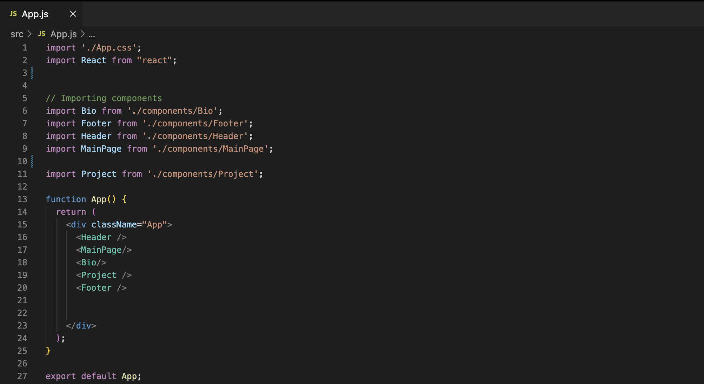

# My Portfolio


## Description

Creating a porfolio as a web-developer is important, because the website itself showcases the technical skills learned, as well as providing a unique space to showcase all of the projects that have been completed! My portfolio is a reflection of my coding journey, and has evolved greatly from the first revision. In order to make several changes, I used "React"! Visit my [portfolio](https://amylipscomb.github.io/portfolio-react/) and enjoy! &#128522;


----
## Table of Contents 

  * [Installation](#installation)
  * [Usage](#usage)
  * [License](#license)
  * [Contribution](#contribution)
  * [Tests](#tests)
  * [Technologies](#technologies)
  * [Questions](#questions)

---
## Installation

After setting up my repo, the first action item I tackled was installing what was necessary. I typed the following into the command line:
```
 npm create react-app portfolio
 ```

This line installed React, and created the folder "Portfolio". I had to create an application folder, because React needs one in order to import the necessary files. This folder created the public folder, src folder, and package.json files. Then after it was made, I copied the files that were created, pasted the information outside of the folder, and then deleted it. 

To eventually deploy my portfolio via GitHub Pages, I had to import github pages. I did this by typing the following into the command line:

```
npm i gh-pages
```
```
npm run deploy
```

Once deployed, if changes were made to my portfolio, the following commands needed to be run, in order to see them on my deployed site:

```
npm run build
```

```
npm run deploy
```

---

## Usage

While using React, I noticed three major advantages:
  1. You can easily see changes made to your code, which makes it easy when working on it and debugging.
  2. It uses HTML, which makes it easier to use.
  3. Reusable components are created. 


I mentioned those three advantages because as I continued to set up my portfolio, it was clear to see. After I installed everything, I then added the HTML and CSS code from my previous version and updated it to fit React. I did this by creating a components folder, and within that folder, created folders for the following components- "Main Page", "Header", "Navigation", "Bio", "Project", and "Footer". Then within those component folders, created Javascript files, and inserted the HTML code within a function that would return the information I wanted. Then, in my "App.js" I imported the CSS, React, and all of the components. Once that was done, I then created an App function and within the function, inserted all of the components. Take a look at the code below.  



To see if everything worked properly, I typed in the following commands:

```
npm run build
```
```
npm start
```

---

## Contribution

  None.

  ---

## License

```
This project is licensed under MIT.
```

---


## Tests

None.

 ---

 ## Technologies

* React
* JavaScript
* GitHub Pages
* VS Code

 ---

## Questions

If you'd like to see more of my projects, check out my github: [amylipscomb](https://github.com/amylipscomb).
For further information please contact me at [amy.a.lipscomb@gmail.com](mailto:amy.a.lipscomb@gmail.com)!